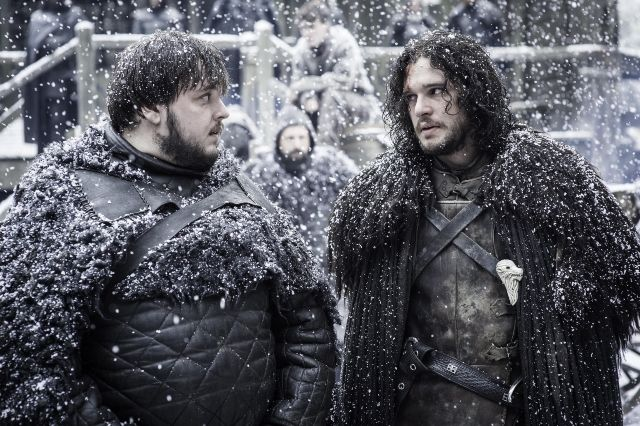

# Header
Hola, soy Aegon Targaryen Antes conocido como Jon Snow

Bastardo de Ned Stark, líder de la Guardia de la noche proclamado
Rey en el Norte, y ahora leal escudero de Daenerys Targaryen.

-------------------------------------------------------

# A qué me dedico

## Guardia de la noche

Lorem ipsum esto es strong dolor sit,
amet consectetur adipisicing elit. En negrita
Et sequi, asperiores neque facere maxime, dignissimos,
accusantium at itálica autem error ducimus tenetur. Quasi,
doloribus consequuntur rerum vel esse eligendi laboriosam beatae.

## Rey en el norte

Etiam est nunc, rutrum in porta eu, faucibus eget ante. Fusce
interdum tellus in neque tincidunt, et vehicula quam ultricies.
Ut sit amet eros turpis. Aenean maximus risus eget nulla bibendum,
a vestibulum elit ornare. Phasellus quam erat, sodales vitae tortor
pulvinar, feugiat efficitur augue.

## Cuidador de dragones

Ut hendrerit sagittis erat, et malesuada arcu eleifend sed.
Sed interdum velit sed sem posuere egestas. Ut efficitur ornare justo,
id consequat enim congue vulputate. Donec posuere, ipsum quis tempor mollis,
enim orci accumsan erat, sed vulputate felis nulla at augue.

## Consejero Real

Praesent augue tellus, sodales tincidunt sodales eget, dictum
quis elit. Orci varius natoque penatibus et magnis dis parturient
montes, nascetur ridiculus mus. Nulla scelerisque efficitur sapien,
at semper augue sagittis ac. Maecenas a ultrices dui, non consectetur
leo.

----------------------------------------------------------------------

# Quién soy

Hijo de Rhaegar Targaryen y Lyanna Stark, soy el último príncipe
de Rocadragón. Fui criado como bastardo de mi tío Lord Eddard Stark
en Invernalia con el nombre de Jon Nieve, para ser protegido de la
aniquilación de la casa Targaryen llevada a cabo por el rey Robert.

 Me uní a la guardia de la noche llegando a convertirme en el Lord Comandante.
Allí me asesinaron y, usando el poder de R'hllor, la Princesa Roja
Melisandre me resucitó por petición de Ser Davos. Quedé liberado de
mis obligaciones como guardia de la noche...

Junto a mi hermanastra Sansa Stark y con la ayuda de Ser Davos, Tormund y
Brienne de Tarth, recuperé Invernalia y fui nombrado Rey en el Norte.
Uniéndome a la Reina Dragón para luchar contra nuestro gran enemigo:
el ejército del Rey de la Noche.

> You've got the North in you - the real North.  
> ―Tormund

Por fin, volví al Castillo Negro, en el muro, para reunirme con Tormund
y volver a donde era mi sitio, al norte, al verdadero norte.

----------------------------------------------------------------------

# Algunas de mis batallas

## La batalla del Castillo Negro

Está encuadrada dentro de la guerra que mantiene la Guardia de la Noche
contra los salvajes (llamados el Pueblo Libre). Esta batalla supone la
derrota de los ejércitos de Mance Rayder y el triunfo de la Guardia con
la colaboración imprescindible de Stannis Baratheon.

## La batalla de los bastardos

Durante la guerra de los Cinco Reinos, Jon Nieve y Sansa Stark recuperan
Invernalia de la que Ramsay Bolton, el Guardián del Norte, se ha apoderado.
Tras la batalla, la Casa Stark vuelve a controlar el norte.

## La batalla de Invernalia

Es la batalla final de la Gran Guerra entre una alianza de ejércitos
(como los Starks, Arryns y Targaryans) contra el ejército de los muertos
encabezados por los caminantes blancos.

## La batalla de Desembarco del Rey

Batalla final entre los seguidores de Daenerys Targaryen y las
fuerzas Lannister lideradas por la Reina Cersei Lannister para
controlar Desembarco del Rey, la capital de los Siete Reinos y
conseguir el Trono de Hierro.

----------------------------------------------------------------------

# Contacto

Nombre:  
e-mail:  
Asunto:  
Mensaje:  

Enviar

----------------------------------------------------------------------

# Para el pie de página

Aquí tienes algunos enlaces para saber más sobre mí:

¿Qué dicen de mí en Fandom?
https://gameofthrones.fandom.com/wiki/Jon_Snow

Wikipedia en español
https://es.wikipedia.org/wiki/Jon_Nieve

Wikipedia en inglés
https://en.wikipedia.org/wiki/Jon_Snow_(character)

Incluir enlaces a:

Facebook
Twitter
LinkedIn
